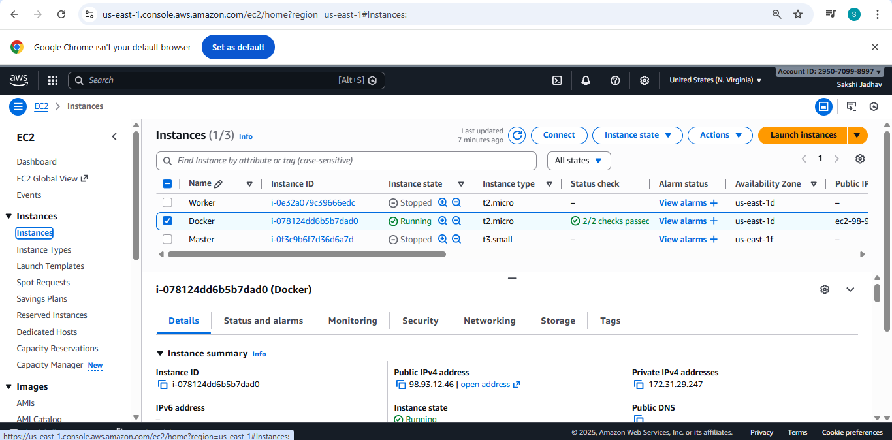
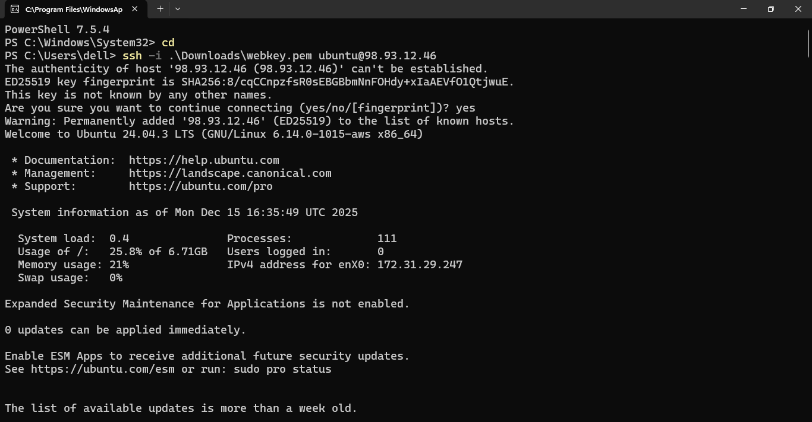
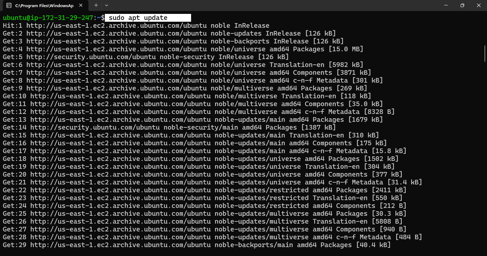
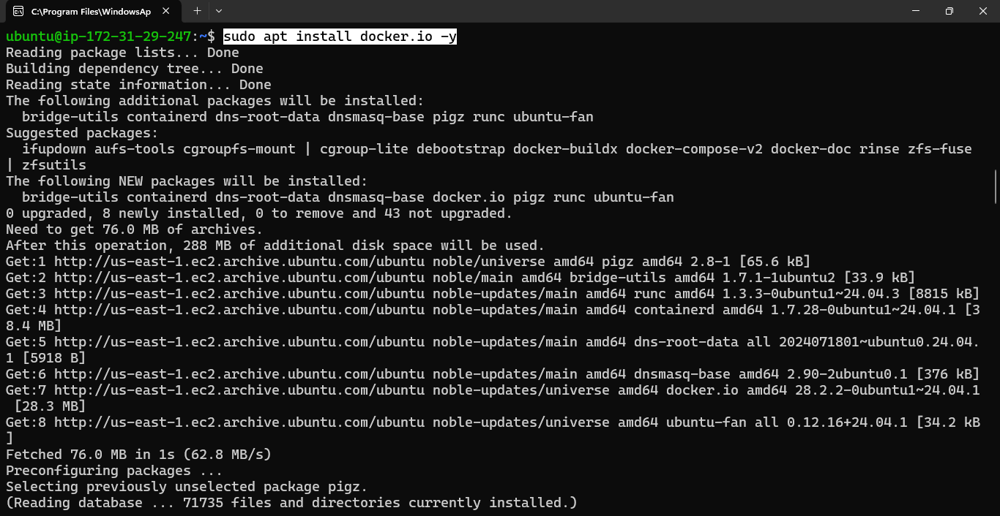
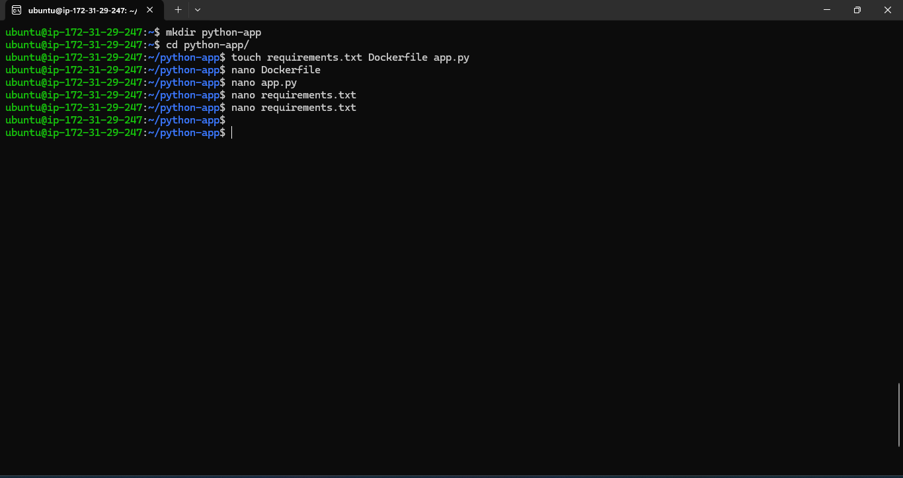
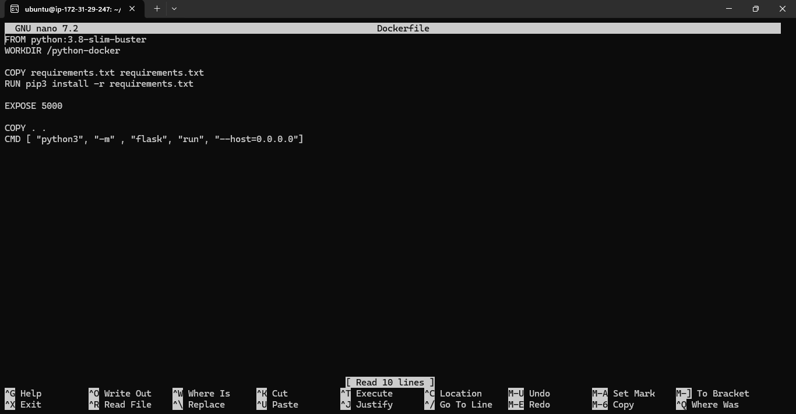
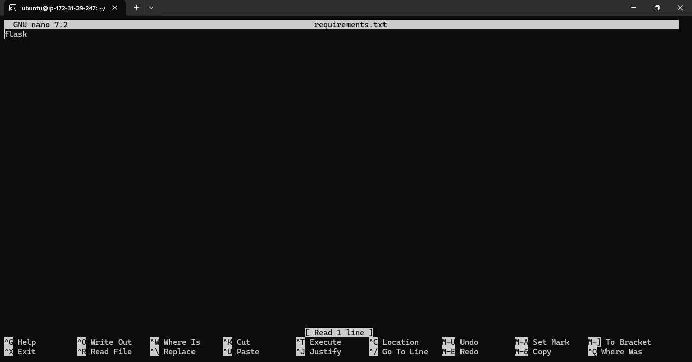
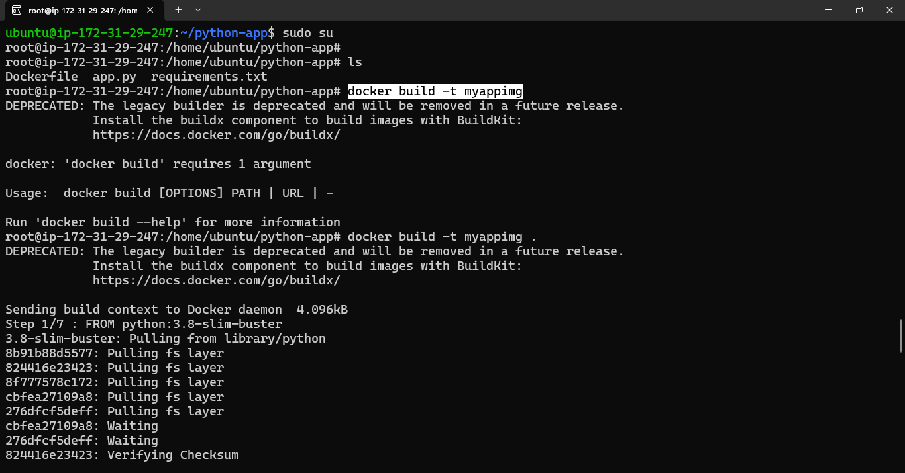
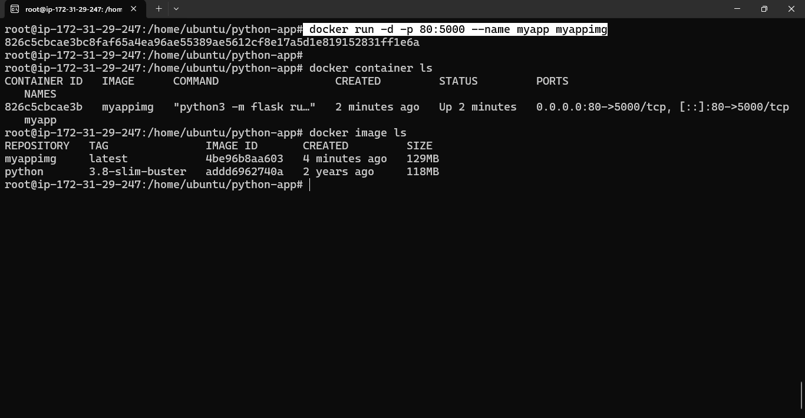
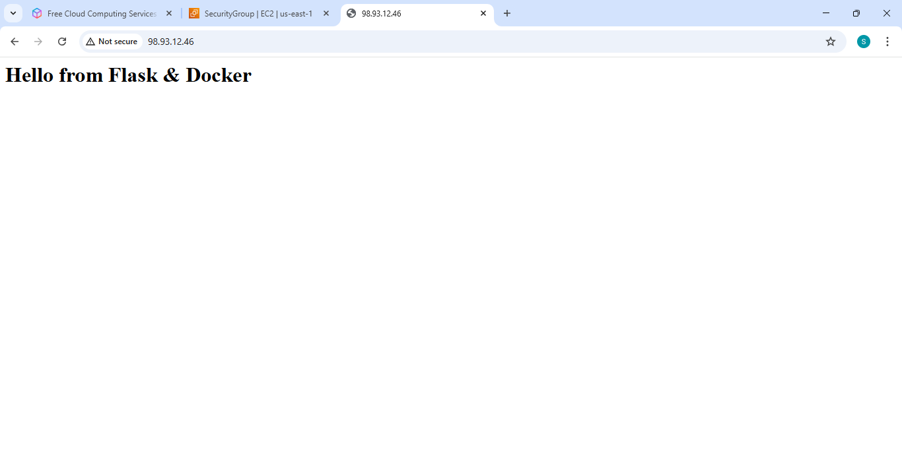

# Python Application using Dockerfile
 ## Project Overview

This project demonstrates how to containerize a simple Python application using a Dockerfile. Docker allows you to package your application along with its dependencies so it runs consistently across different environments

### Basic Requirements:
python-docker-app/

│── app.py
│── requirements.txt
│── Dockerfile

## Step-By-Step

### Step 1:- Launch Instance
- Add port 5000 in the security group

### Step 2:- Connect to server

### Step 3:- Update package
- sudo apt update

### Step 4:- Install docker
- sudo apt install docker.io -y

### Step 5:- Create one directory and 3 files
- sudo su
- mkdir python-app
- app.py, dockerfile, requirements.txt

#### 1. Dockerfile

#### 2. app.py

#### 3. requirements.txt

### Step 6:- Build docker image
-  docker build -t myappimg .

### Step 7:- Run the container
- docker run -d -p 80:5000 --name myapp myappimg

### step 8:- Access using ip

## Conclusion

This project helps understand the basics of Docker by containerizing a simple Python application. It is a great starting point for learning Docker and container-based deployments.
